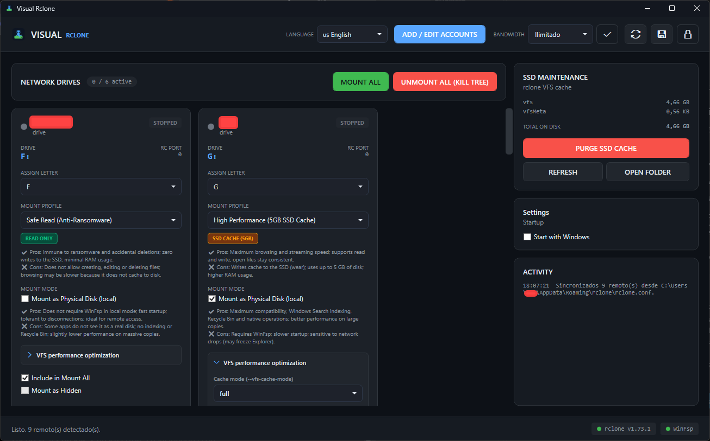
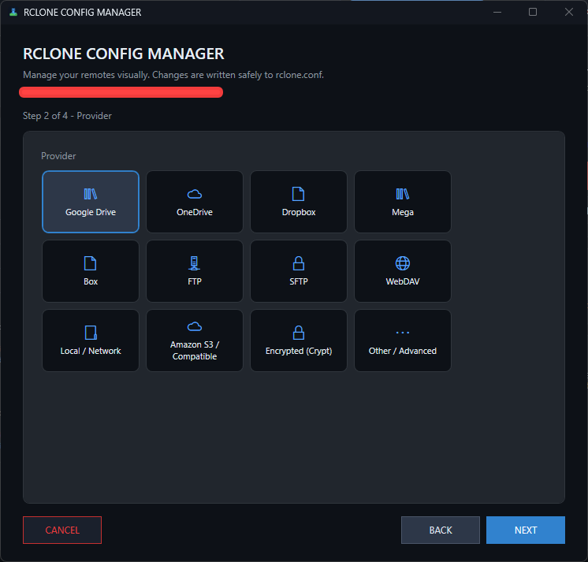

<div align="center">

# 🚀 Visual Rclone

### Mount your cloud drives with a click — **no more CMD, no more cryptic flags.**

A modern, dark-themed Windows control panel that turns **rclone** into a friendly,
visual experience. Discover your remotes, mount them as real drives, watch the
traffic live, and manage everything from a single window.

[](LICENSE)
[](../../releases)
[](https://dotnet.microsoft.com/download/dotnet/8.0)
[](#-requirements)
[](#-architecture)
[](CONTRIBUTING.md)

</div>

---

## 📖 What is Visual Rclone?

**rclone** is an incredibly powerful tool — but mounting a cloud drive with it
means memorizing flags like `--vfs-cache-mode full --rc-addr localhost:5572`,
managing background processes by hand, and keeping a terminal open forever.

**Visual Rclone eliminates all of that.**

It reads your existing `rclone.conf`, shows every remote as a card, and lets you
mount, unmount, monitor and configure everything with the mouse. Under the hood it
still uses the official `rclone.exe` — so your credentials, tokens and provider
quirks keep working exactly as before.

> **Zero hardcoded configuration.** Any user can install it and use it with their
> own cloud providers. No remote name is ever baked into the source code.

---

## 📸 Screenshots

### Main dashboard — every remote as a live card

<p align="center">
  
</p>

### Real-time traffic monitor — live throughput per drive

<p align="center">
  
</p>

---

## ✨ Key Features

<table>
<tr>
<td width="50%" valign="top">

### 🖱️ One-click mounting
- **Dynamic remote discovery** — parses your `rclone.conf` at runtime.
- **Isolated RC ports** — one `rclone.exe` per drive, each on its own port.
  No collisions, ever.
- **Mount All / Unmount All (Kill Tree)** — global actions in one click.
- **Guaranteed cleanup** — no orphan processes, even after a crash.

### 📊 Real-time VFS monitor
- **Live transfer chart** — upload/download throughput per drive, straight
  from the rclone RC API.
- **Hot bandwidth limiter** — cap the speed of *all* drives without
  restarting them. Presets or custom rates (`500K`, `1.5M`, `2G`).
- **SSD maintenance** — see the VFS cache size and purge it with one button.

</td>
<td width="50%" valign="top">

### 🗂️ System tray & background mode
- **Minimize to tray** and keep every drive mounted in the background.
- **Tray context menu** — Open, Unmount All, Exit Completely.
- **Smart close dialog** — choose *Run in Background*, *Exit and Unmount*
  or *Cancel*.

### 🔐 Security first
- **Master PIN** — PBKDF2-SHA256, 210,000 iterations, random salt.
- **Trust this device** — optional hardware fingerprint with expiry.
- **Safe deletion** — removing a remote always asks for confirmation.

### 🎨 Built for humans
- **Dark "Server Panel" theme** — elevated cards, accent highlights.
- **4 languages** — English, Spanish, French, German (switchable live).
- **Interactive Config Manager** — a 4-step wizard to add remotes safely.
- **Diagnostic console** — the last 100 log lines per drive.

</td>
</tr>
</table>

---

## 🧩 Mount Profiles

Choose a profile per remote — or write your own arguments.

| Profile | Injected arguments | Best for |
|---|---|---|
| **🛡️ Safe Read** *(anti-ransomware)* | `--read-only --vfs-cache-mode off --dir-cache-time 72h --fast-list` | Browsing, backups, read-only archives |
| **⚡ High Performance** | `--vfs-cache-mode full --vfs-cache-max-size 5G --vfs-read-chunk-size 64M --vfs-write-back 5s` | Media streaming, large files |
| **📦 Bulk Transfer** | `--vfs-cache-mode writes --buffer-size 128M --dir-cache-time 1h` | Uploading many small files |
| **🔧 Custom** | *your own flags* | Power users |

---

## 📋 Requirements

| Component | Why you need it | Link |
|---|---|---|
| **Windows 10 / 11** (x64) | The app is a WPF desktop application | — |
| **.NET 8 Desktop Runtime** | To run the compiled app | [Download](https://dotnet.microsoft.com/download/dotnet/8.0) |
| **rclone** | The engine that actually talks to your cloud | [Download](https://rclone.org/downloads/) |
| **WinFsp** | Required by rclone to mount drives on Windows | [Download](https://winfsp.dev/rel/) |

> 💡 If you build from source you need the **.NET 8 SDK** instead of just the
> runtime.

---

## 📥 Installation

### Option A — Ready-to-use installer *(recommended)*

Grab the pre-built, self-contained installer from the link in the
[Support the Project](#-support-the-project) section below. No dependencies to
install manually — just run it.

### Option B — Build from source

```cmd
git clone https://github.com/<your-user>/VisualRclone.git
cd VisualRclone
dotnet restore
dotnet build -c Release
dotnet run --project src\RcloneCommanderAdvanced
```

### Option C — Produce a portable single-file executable

```cmd
dotnet publish src\RcloneCommanderAdvanced -c Release -r win-x64 ^
  --self-contained true -p:PublishSingleFile=true ^
  -p:IncludeAllContentForSelfExtract=true -p:DebugType=None
```

The result is a single `.exe` in:

```
src\RcloneCommanderAdvanced\bin\Release\net8.0-windows\win-x64\publish\
```

### First run

1. Launch the app — it will ask you to create a **master PIN**.
2. If `rclone.exe` is not in your `PATH`, point the app to it in **Settings**.
3. Click **Manage Accounts** to add a remote with the 4-step wizard.
4. Pick a drive letter and a profile, then hit **Mount**. Done. 🎉

---

## 🏗️ Architecture

Visual Rclone follows a strict **MVVM** pattern with **dependency injection**.

```
┌──────────────────────────────────────────────────────────────┐
│                          App.xaml.cs                         │
│   ServiceProvider (Microsoft.Extensions.DependencyInjection) │
└───────────────┬──────────────────────────────────────────────┘
                │
    ┌───────────┴────────────┐
    │                        │
┌───▼────────┐        ┌──────▼──────┐
│   Views    │◄──────►│ ViewModels  │
│  (XAML)    │ Binding│  (Toolkit)  │
└────────────┘        └──────┬──────┘
                             │ Interfaces
                    ┌────────▼─────────┐
                    │     Services     │
                    │  (Abstractions)  │
                    └────────┬─────────┘
                             │
              ┌──────────────┼──────────────┐
              │              │              │
      ┌───────▼──────┐ ┌─────▼─────┐ ┌──────▼──────┐
      │ rclone.conf  │ │ rclone.exe│ │ appsettings │
      │  (parsing)   │ │(processes)│ │    .json    │
      └──────────────┘ └───────────┘ └─────────────┘
```

### Project structure

```
VisualRclone/
├── .github/                          # Issue & PR templates
├── docs/                             # Screenshots and extra docs
├── src/
│   └── RcloneCommanderAdvanced/
│       ├── App.xaml(.cs)             # DI + startup flow + cleanup on exit
│       ├── Models/                   # Plain data models
│       ├── Services/                 # Business logic (behind interfaces)
│       │   ├── Abstractions/         # Contracts
│       │   ├── RcloneConfigParser.cs # rclone.conf reading/parsing
│       │   ├── RcloneConfigManager.cs# Safe remote create/delete via CLI
│       │   ├── MountProcessManager.cs# Core: processes, ports, kill tree
│       │   ├── RcloneRcClient.cs     # RC API client (stats, bwlimit)
│       │   ├── VfsMaintenanceService.cs
│       │   ├── SecurityService.cs    # Master PIN (PBKDF2)
│       │   └── LocalizationService.cs
│       ├── ViewModels/               # MVVM view models
│       ├── Views/                    # XAML windows
│       ├── Converters/               # WPF value converters
│       └── Themes/
│           ├── DarkTheme.xaml        # "Dark Mode / Server Panel" palette
│           └── Lang.*.xaml           # en-US, es-ES, fr-FR, de-DE
├── CONTRIBUTING.md
├── CHANGELOG.md
├── LICENSE
└── README.md
```

---

## 🌍 Localization

| Code | Language |
|---|---|
| `en-US` | English *(default / fallback)* |
| `es-ES` | Spanish |
| `fr-FR` | French |
| `de-DE` | German |

Translations live in `Themes/Lang.*.xaml` and are swapped at runtime — **no
restart required**. Want to add a language? See
[CONTRIBUTING.md](CONTRIBUTING.md#-adding-or-updating-a-translation).

---

## 🔒 Privacy & Security

- **No personal data in the repository.** All user-specific values (remote names,
  drive letters, paths, credentials, PIN) are read at runtime from `rclone.conf`
  and `appsettings.json`, both excluded from version control.
- **No hardcoded paths.** The source uses `Environment.GetFolderPath(...)` and
  `AppDomain.CurrentDomain.BaseDirectory` exclusively.
- **The PIN is never stored in plain text.** Derivation:
  `PBKDF2(password, salt, 210000, SHA256, 32 bytes)` with a random 32-byte salt
  and constant-time comparison.
- **rclone.conf is never edited by hand.** All mutations go through the official
  `rclone config` CLI, so secrets stay encrypted.

---

## 🤝 Contributing

Contributions are what make open source amazing! Whether it's a bug report, a
translation, a documentation fix or a new feature — you are welcome.

Please read **[CONTRIBUTING.md](CONTRIBUTING.md)** for the development setup,
architecture rules and PR process.

- 🐛 Found a bug? [Open a Bug Report](../../issues/new?template=bug_report.md)
- ✨ Have an idea? [Open a Feature Request](../../issues/new?template=feature_request.md)
- 🌍 Want to translate? [Read the guide](CONTRIBUTING.md#-adding-or-updating-a-translation)

---

## ☕ Support the Project

Visual Rclone is **free and open source** (MIT). If it saved you time and
frustration, consider supporting its development — it keeps the project alive and
funds new features.

> ### ☕ [Support the developer and download the ready-to-use installer on Gumroad!](YOUR_GUMROAD_LINK_HERE)

Every contribution, star ⭐ and share helps more than you think. Thank you!

---

## 🛠️ Built With & Credits

**Visual Rclone** was designed and developed by **AIMDYCK**.

This project was built with the help of the following tools and technologies:

- **Visual Studio** — the primary IDE for WPF / .NET 8 development, debugging and publishing.
- **Supermaven** — AI-powered code completion that accelerated day-to-day coding.
- **Roo Code** — the AI coding agent used to plan, refactor and implement the application.
- **DeepSeek API** — the large language model powering the AI-assisted development workflow.

A heartfelt thank you to the open source community behind **rclone** and **WinFsp**,
without whom this project would not exist.

---

## 📄 License

Released under the [MIT License](LICENSE).

**rclone** and **WinFsp** are independent projects with their own licenses and are
not affiliated with Visual Rclone.

<div align="center">

**Made with ❤️ for the rclone community**

⭐ If you like this project, don't forget to star the repository! ⭐

</div>
